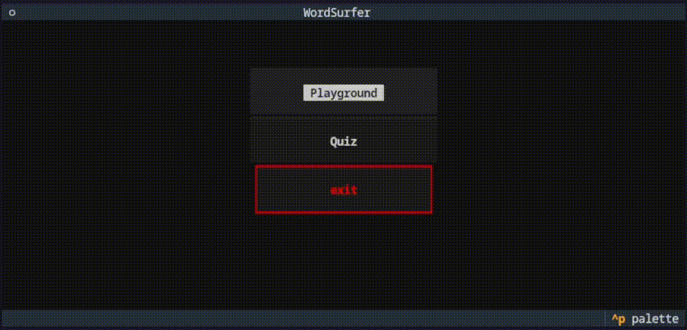

# WordSurfer

> inspired by [NLP Course For You](https://lena-voita.github.io/nlp_course.html) 💜

`WordSurfer` is a playful exploration of word embedding.

## Overview

`WordSurfer` is an terminal-based game that lets you experiment with wonderful properties of word embeddings. Built with Python's [Textual](https://github.com/Textualize/textual) framework, it currently has a functional TUI interface (with CSS styling improvements planned).

Everything in the project is built around one thing: wonderful properties of [GloVe](https://aclanthology.org/D14-1162.pdf) and [Word2Vec](https://proceedings.neurips.cc/paper_files/paper/2013/file/9aa42b31882ec039965f3c4923ce901b-Paper.pdf) ([which is in core the same as based on ppmi count-based method](https://proceedings.neurips.cc/paper_files/paper/2014/file/b78666971ceae55a8e87efb7cbfd9ad4-Paper.pdf)) word embeddings (which you can read about [here](https://proceedings.neurips.cc/paper_files/paper/2018/file/b534ba68236ba543ae44b22bd110a1d6-Paper.pdf), [here](https://proceedings.mlr.press/v97/allen19a/allen19a.pdf) and [here](https://proceedings.neurips.cc/paper_files/paper/2016/file/a486cd07e4ac3d270571622f4f316ec5-Paper.pdf)).

## Key Features

- Interactive playground for word vector arithmetic
- Quiz mode to test your intuition about word relationships
- Clean terminal interface with intuitive navigation.

## Future plans

- **More NLP!**

    Now app covers only one area of NLP but there is a lot of opportunities. For example, ai-generated localization and messages with some sentiment depending on user's achievements 😏 and more.

- **Vocabulary cleaning.**

    The quiz mode is full of strange combinations such as `ls + cat - dr`, the result of which is really difficult to predict. This could result in bored to death community. The game needs some kind of filter.

- **Design.**

    *There is just a lot of stuff.*

- **Documentation.**
    
    Currently only few functions and classes have complete docs.
