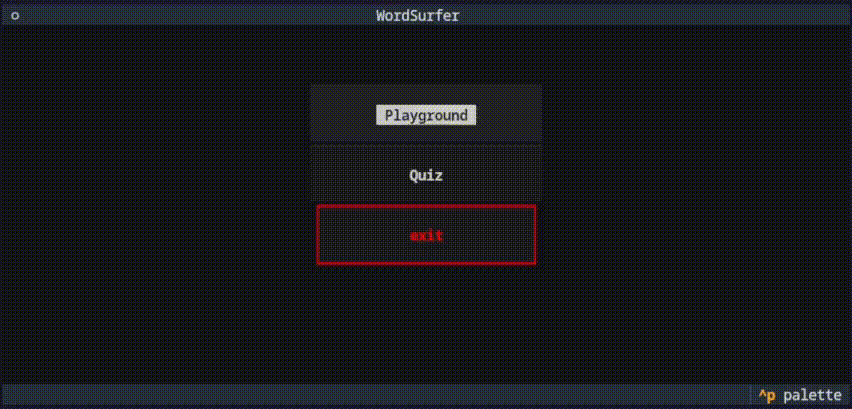

# WordSurfer

> inspired by [NLP Course For You](https://lena-voita.github.io/nlp_course.html) 💜

Game to play with word embeddings.

The app has simple TUI implemented with [Textual](https://github.com/Textualize/textual) (css is waiting for upgrade). 

## Concept

Everything in the project is built around one thing: wonderful properties of [GloVe](https://aclanthology.org/D14-1162.pdf) and [Word2Vec](https://proceedings.neurips.cc/paper_files/paper/2013/file/9aa42b31882ec039965f3c4923ce901b-Paper.pdf) ([which is in core the same as based on ppmi count-based method](https://proceedings.neurips.cc/paper_files/paper/2014/file/b78666971ceae55a8e87efb7cbfd9ad4-Paper.pdf)) word embeddings (which you can read about [here](https://proceedings.neurips.cc/paper_files/paper/2018/file/b534ba68236ba543ae44b22bd110a1d6-Paper.pdf), [here](https://proceedings.mlr.press/v97/allen19a/allen19a.pdf) and [here](https://proceedings.neurips.cc/paper_files/paper/2016/file/a486cd07e4ac3d270571622f4f316ec5-Paper.pdf)).